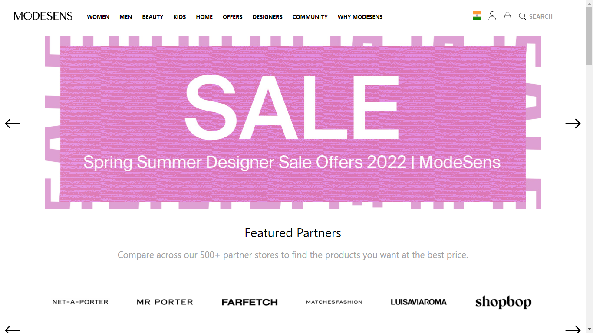
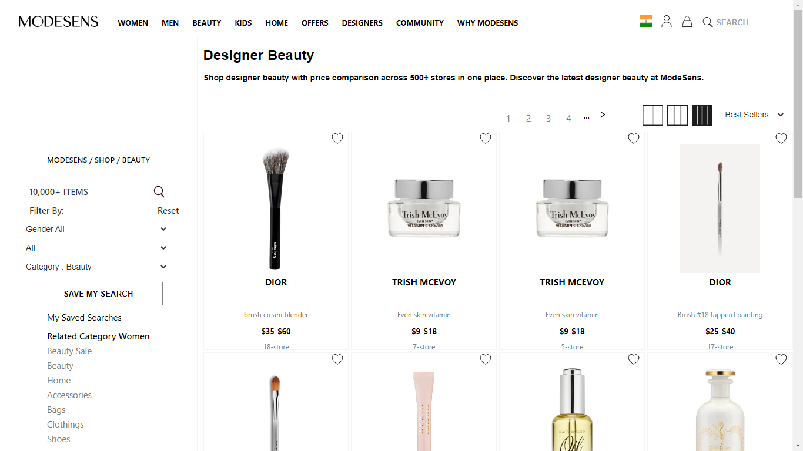
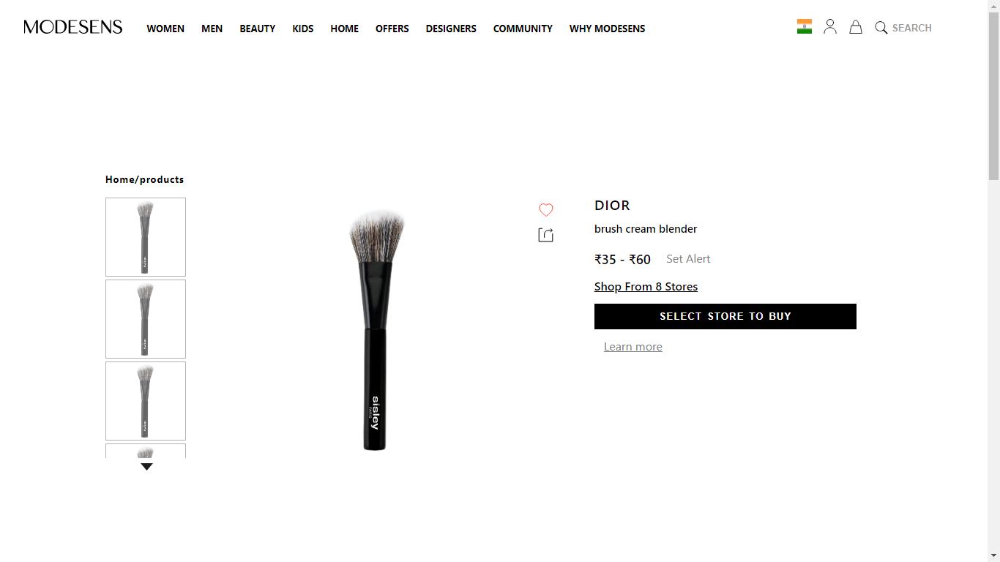
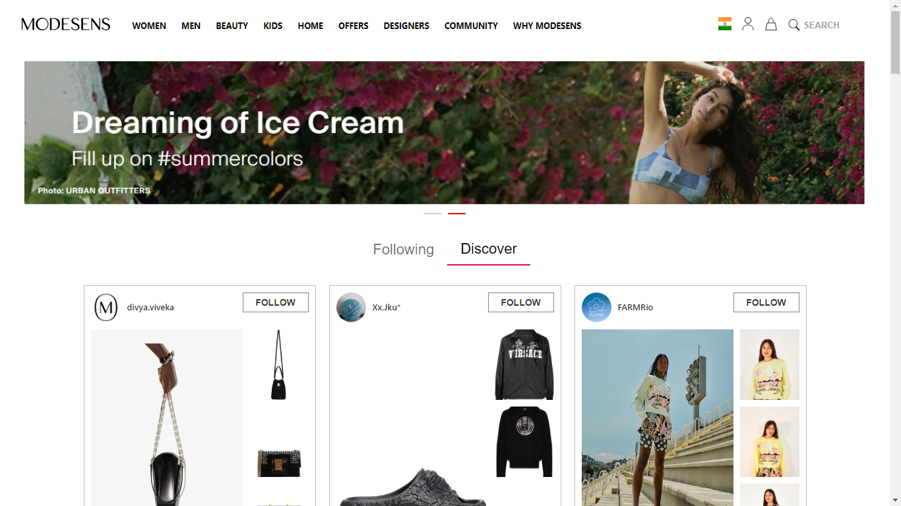

# Modesens-Clone

ModeSens is your digital shopping assistant for the smart and informed.

Established in 2015, ModeSens is led by a team of industry experts who developed a solution to the disconnected and crowded online shopping experience. Product information was scattered, and shopping required too much research to make an informed purchase.

The result was an advanced platform that connects information to shoppers seamlessly for a secure and efficient experience — one that is wholly unique to our customers.

# Some glimpse from our Website

<h1>Home Page</h1>

<h1>Products Page</h1>

<h1>Single Product Page</h1>

<h1>Community Page</h1>

# [Getting Started]

<h3>Execution</h3>

If you want to run our project in your local machine

Follow the given steps:

<ul>
<li>Clone our repository <a href="https://github.com/Parth-Bisht/Modesens-Clone.git">https://github.com/Parth-Bisht/Modesens-Clone.git</a></li>
<li>Open our code in VS code</li>
<li>Go to the client folder using cd client command</li>
<li>In the terminal write npm install, it will install all the dependencies for our project</li>
<li>Than simply write npm start</li>
<li>Congratulations! Now you can navigate to our website</li>
</ul>

<h1>Tech Stack</h1>
<ul>
<li>React.JS</li>
<li>Material UI</li>
<li>MongoDB</li>
<li>Express</li>
<li>Node</li>
</ul>

# Creators

<ul>
  <li><a href="https://github.com/Parth-Bisht">@Parth Bisht</a></li>
  <li><a href="https://github.com/muskan2507">@Muskan Shaw</a></li>
  <li><a href="https://github.com/Navedphysicist">@Naved Khan</a></li>
  <li><a href="https://github.com/iamdebobrota">@Debu Haldar</a></li>
  <li><a href="https://github.com/Nandudumare">@Nandu Dumare</a></li>
  <li><a href="https://github.com/Anmolroan">@Anmol Raon</a></li>
</ul>

Server link : https://modesensclonefw16.herokuapp.com/

